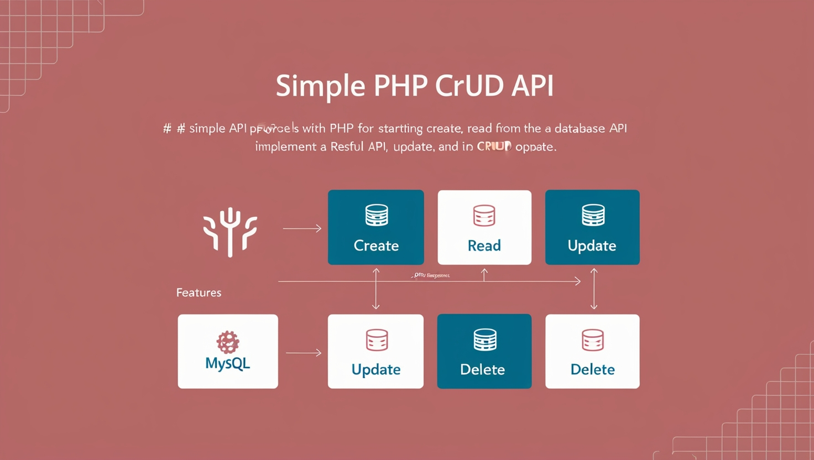

# Simple PHP CRUD API



## Overview

This project provides a simple API built with PHP for performing basic Create, Read, Update, and Delete (CRUD) operations. It serves as a starting point for developers looking to implement a RESTful API using PHP and MySQL.

## Features

- **Create**: Insert new records into the database.
- **Read**: Fetch records from the database.
- **Update**: Modify existing records.
- **Delete**: Remove records from the database.
- **JSON Response**: All responses are returned in JSON format.

## Requirements

- PHP 7.0 or higher
- MySQL
- Composer (optional for managing dependencies)

## Installations

1. **Clone the repository**:

   ```bash
   git clone https://github.com/KevinThulnith/php-crud-api.git
   ```

2. **Postman**:<br>
   Install postman to test php-crud-api. Open command prompt and give this command + enter, visit 🔗<a href="https://www.postman.com/downloads/">postman.com</a> to install.
   ```bash
   winget install -e --id Postman.Postman
   ```
